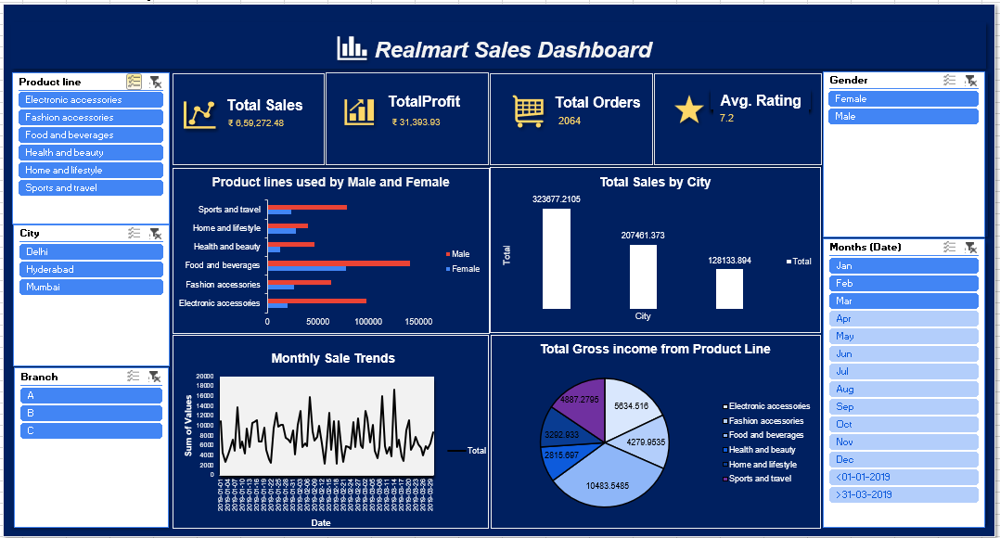

# Excel Sales Dashboard

This project is an interactive Sales Dashboard created using Microsoft Excel as part of my Data Analytics internship learning. The goal of this dashboard is to present sales data in a clear and visual format to help understand trends, performance, and key business insights.

## Dashboard Overview

The dashboard provides a summary of important business metrics including:
- Total Sales
- Total Profit
- Total Orders
- Average Rating

It also visualizes sales data using different charts and graphs to make analysis easier.

## Key Insights Visualized

- Total Sales by City
- Product lines used by Male and Female customers
- Monthly Sales Trends
- Total Gross Income from each Product Line

## Filters and Interactivity

The dashboard includes slicers that allow users to interactively filter the data by:
- Product Line
- City
- Branch
- Gender
- Month

These filters help in analyzing sales performance from different perspectives.

## Tools Used

Microsoft Excel  
Pivot Tables  
Pivot Charts  
Slicers  
Data Visualization Techniques

## Purpose of the Project

This project was created as part of my learning during a Data Analytics internship to improve my skills in:
- Data analysis
- Dashboard creation
- Data visualization
- Excel reporting

## Dashboard Preview

